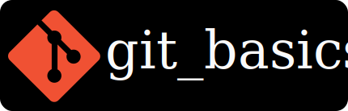

	
	 
	 
	<b>A website for the basics of Git and GitHub-like services.</b>
	 
	 
	View the PWA at <a href="https://harshkapadia2.github.io/git_basics">HarshKapadia2.github.io/git_basics</a>
	 
	or
	 
	

### Author's Sessions

-   [Git Basics - The basics of Git and GitHub!](https://www.youtube.com/watch?v=HF12-91iazM)
-   [Hacktoberfest, Open Source and Pull Requests](https://www.youtube.com/watch?v=uJdFNksgKJA)
-   [Git Internals - How Does Git Work!?](https://www.youtube.com/watch?v=TZRS9llBBYU)

### Contributions

-   All contributions are most welcome!
-   View the [`CONTRIBUTING.md`](CONTRIBUTING.md) file for further instructions.

### Code of Conduct

Please be mindful of the [Code of Conduct](CODE_OF_CONDUCT.md) while contributing and interacting.

 

	Created using <a href="https://harshkapadia2.github.io/asciidoctor-jet"><i>Asciidoctor Jet</i></a>.
	 
	The Git logo belongs to <a href="https://www.git-scm.com">Git</a> and is used under the <a href="https://creativecommons.org/licenses/by/3.0/deed.en">CC BY 3.0 license</a>.

